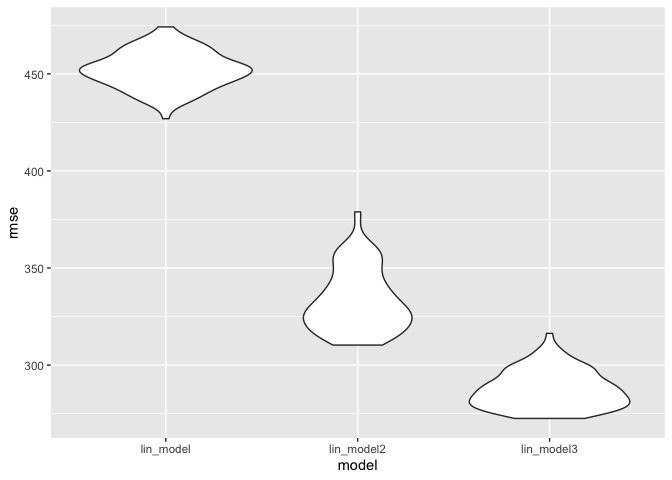

Homework 6
================
Gauri Bhatkhande
09/12/2020

``` r
library(tidyverse)
```

    ## ── Attaching packages ─────────────────────────────────────── tidyverse 1.3.0 ──

    ## ✓ ggplot2 3.3.2     ✓ purrr   0.3.4
    ## ✓ tibble  3.0.3     ✓ dplyr   1.0.2
    ## ✓ tidyr   1.1.2     ✓ stringr 1.4.0
    ## ✓ readr   1.3.1     ✓ forcats 0.5.0

    ## ── Conflicts ────────────────────────────────────────── tidyverse_conflicts() ──
    ## x dplyr::filter() masks stats::filter()
    ## x dplyr::lag()    masks stats::lag()

``` r
library(modelr)
library(mgcv)
```

    ## Loading required package: nlme

    ## 
    ## Attaching package: 'nlme'

    ## The following object is masked from 'package:dplyr':
    ## 
    ##     collapse

    ## This is mgcv 1.8-33. For overview type 'help("mgcv-package")'.

## Problem 2

**Importing the dataset**

``` r
birthweight_data = read_csv(file = "./data/birthweight.csv")
```

    ## Parsed with column specification:
    ## cols(
    ##   .default = col_double()
    ## )

    ## See spec(...) for full column specifications.

**Cleaning the dataset**

``` r
birthweight_data %>%
  sapply(function(x) sum(is.na(x))) 
```

    ##  babysex    bhead  blength      bwt    delwt  fincome    frace  gaweeks 
    ##        0        0        0        0        0        0        0        0 
    ##  malform menarche  mheight   momage    mrace   parity  pnumlbw  pnumsga 
    ##        0        0        0        0        0        0        0        0 
    ##    ppbmi     ppwt   smoken   wtgain 
    ##        0        0        0        0

``` r
birthweight_df = 
  birthweight_data %>%
  mutate(
    babysex = as.factor(babysex) 
  )
```

**Proposed regression model for the outcome birthweight.**

Based on hypothesis found in literature, I have selected the following
variables as predictors: Mother’s weight gain during pregnancy (pounds)
(wtgain) Gestational age in weeks (gaweeks) Smoking status - Average
number of cigarettes smoked per day during pregnancy (smoken) Baby’s sex
(babysex)

This model was decided based on literature evidence that suggested an
association between these predictors and the baby’s birthweight.

**Building the proposed model:**

``` r
lin_model = lm(bwt ~ wtgain + gaweeks + smoken + babysex, data = birthweight_df)

lin_model %>%
  broom::tidy() %>% 
  select(term, estimate, p.value) %>% 
  mutate(term = str_replace(term, "babysex2", "baby's sex: female")) %>% 
  knitr::kable(digits = 3)
```

| term               | estimate | p.value |
| :----------------- | -------: | ------: |
| (Intercept)        |  498.904 |       0 |
| wtgain             |    8.859 |       0 |
| gaweeks            |   63.239 |       0 |
| smoken             |  \-6.733 |       0 |
| baby’s sex: female | \-93.515 |       0 |

``` r
birthweight_df %>% 
  modelr::add_residuals(lin_model) %>% 
  modelr::add_predictions(lin_model) %>%
  ggplot(aes(x = pred, y = resid)) + geom_point()
```

<!-- -->

**Buiding the other two models:**

Model 2:

``` r
lin_model2 = lm(bwt ~ blength + gaweeks, data = birthweight_df)

lin_model2 %>%
  broom::tidy() %>% 
  select(term, estimate, p.value) %>% 
  knitr::kable(digits = 3)
```

| term        |   estimate | p.value |
| :---------- | ---------: | ------: |
| (Intercept) | \-4347.667 |       0 |
| blength     |    128.556 |       0 |
| gaweeks     |     27.047 |       0 |

Model 3:

``` r
lin_model3 = lm(bwt ~ bhead + blength + babysex, data = birthweight_df)

lin_model3 %>%
  broom::tidy() %>% 
  select(term, estimate, p.value) %>% 
  mutate(term = str_replace(term, "babysex2", "baby's sex: female")) %>% 
  knitr::kable(digits = 3)
```

| term               |   estimate | p.value |
| :----------------- | ---------: | ------: |
| (Intercept)        | \-6121.391 |       0 |
| bhead              |    148.175 |       0 |
| blength            |     85.016 |       0 |
| baby’s sex: female |     41.086 |       0 |

Fit the three models

``` r
lin_model = lm(bwt ~ wtgain + gaweeks + smoken + babysex, data = birthweight_df)
lin_model2 = lm(bwt ~ blength + gaweeks, data = birthweight_df)
lin_model3 = lm(bwt ~ bhead + blength + babysex + bhead*blength + blength*babysex + bhead*babysex +  bhead*blength*babysex, data = birthweight_df)
```

Cross validation

``` r
cv_df = 
  crossv_mc(birthweight_df, 100) 


cv_df =
  cv_df %>% 
  mutate(
    train = map(train, as_tibble),
    test = map(test, as_tibble))
```

``` r
cv_df = 
  cv_df %>% 
  mutate(
    lin_model  = map(train, ~lin_model),
    lin_model2  = map(train, ~lin_model2),
    lin_model3  = map(train, ~lin_model3)
    )%>% 
  mutate(
    rmse_lin_model  = map2_dbl(lin_model, test, ~rmse(model = .x, data = .y)),
    rmse_lin_model2 = map2_dbl(lin_model2, test, ~rmse(model = .x, data = .y)),
    rmse_lin_model3 = map2_dbl(lin_model3, test, ~rmse(model = .x, data = .y))
    )

cv_df %>% 
  select(starts_with("rmse")) %>% 
  pivot_longer(
    everything(),
    names_to = "model", 
    values_to = "rmse",
    names_prefix = "rmse_") %>% 
  mutate(model = fct_inorder(model)) %>% 
  ggplot(aes(x = model, y = rmse)) + geom_violin()
```

<!-- -->
