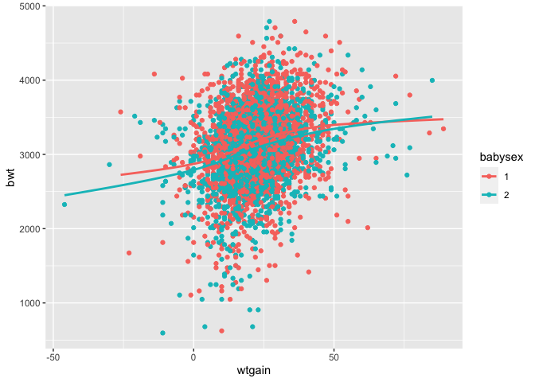
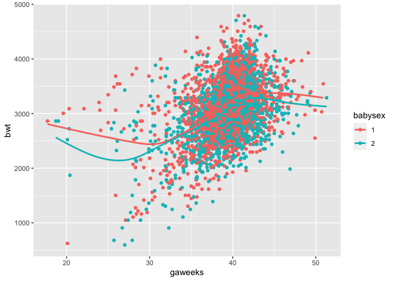
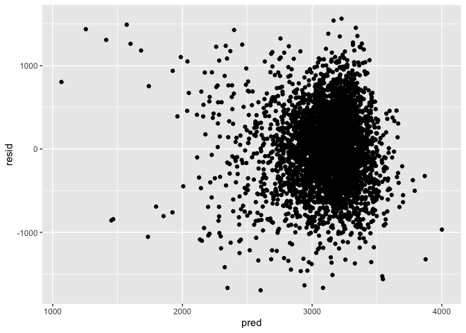

Homework 6
================
Gauri Bhatkhande
09/12/2020

``` r
library(tidyverse)
```

    ## ── Attaching packages ─────────────────────────────────────── tidyverse 1.3.0 ──

    ## ✓ ggplot2 3.3.2     ✓ purrr   0.3.4
    ## ✓ tibble  3.0.3     ✓ dplyr   1.0.2
    ## ✓ tidyr   1.1.2     ✓ stringr 1.4.0
    ## ✓ readr   1.3.1     ✓ forcats 0.5.0

    ## ── Conflicts ────────────────────────────────────────── tidyverse_conflicts() ──
    ## x dplyr::filter() masks stats::filter()
    ## x dplyr::lag()    masks stats::lag()

``` r
library(modelr)
library(mgcv)
```

    ## Loading required package: nlme

    ## 
    ## Attaching package: 'nlme'

    ## The following object is masked from 'package:dplyr':
    ## 
    ##     collapse

    ## This is mgcv 1.8-33. For overview type 'help("mgcv-package")'.

## Problem 2

**Importing the dataset**

``` r
birthweight_data = read_csv(file = "./data/birthweight.csv")
```

    ## Parsed with column specification:
    ## cols(
    ##   .default = col_double()
    ## )

    ## See spec(...) for full column specifications.

**Cleaning the dataset**

``` r
birthweight_data %>%
  sapply(function(x) sum(is.na(x))) 
```

    ##  babysex    bhead  blength      bwt    delwt  fincome    frace  gaweeks 
    ##        0        0        0        0        0        0        0        0 
    ##  malform menarche  mheight   momage    mrace   parity  pnumlbw  pnumsga 
    ##        0        0        0        0        0        0        0        0 
    ##    ppbmi     ppwt   smoken   wtgain 
    ##        0        0        0        0

``` r
birthweight_df = 
  birthweight_data %>%
  mutate(
    babysex = as.factor(babysex) 
  )
```

**Proposed regression model for the outcome birthweight.**

Based on hypothesis found in literature, I have selected the following
variables as predictors: Mother’s weight gain during pregnancy (pounds)
(wtgain) Gestational age in weeks (gaweeks) Baby’s sex (babysex)

This model was decided based on literature evidence that suggested an
association between these predictors and the baby’s birthweight.

However, before building the regression model, we assume linearity and
hence it is necessary to make a scatterplot to see if the outcome and
predictor are linearly related.

**Making a scatterplot**

``` r
ggplot(birthweight_df, aes(x = wtgain, y = bwt, color = babysex)) + 
  geom_point() +
  geom_smooth(se = FALSE)
```

    ## `geom_smooth()` using method = 'gam' and formula 'y ~ s(x, bs = "cs")'

<!-- -->

``` r
ggplot(birthweight_df, aes(x = gaweeks, y = bwt, color = babysex)) + 
  geom_point() +
  geom_smooth(se = FALSE)
```

    ## `geom_smooth()` using method = 'gam' and formula 'y ~ s(x, bs = "cs")'

<!-- -->

It appears that there could be a linear relationship among the
predictors Mother’s weight and Gestational age when stratified by Baby’s
sex. Therefore I also decided to include the interaction term.

**Building the proposed model:**

``` r
lin_model = lm(bwt ~ wtgain*gaweeks*babysex, data = birthweight_df)

lin_model %>%
  broom::tidy() %>% 
  select(term, estimate, p.value) %>% 
  mutate(term = str_replace(term, "babysex2", "baby's sex: female")) %>% 
  knitr::kable(digits = 3)
```

| term                              |  estimate | p.value |
| :-------------------------------- | --------: | ------: |
| (Intercept)                       | \-979.074 |   0.000 |
| wtgain                            |    78.773 |   0.000 |
| gaweeks                           |   100.188 |   0.000 |
| baby’s sex: female                |   252.919 |   0.478 |
| wtgain:gaweeks                    |   \-1.773 |   0.000 |
| wtgain:baby’s sex: female         |  \-15.187 |   0.316 |
| gaweeks:baby’s sex: female        |   \-8.817 |   0.332 |
| wtgain:gaweeks:baby’s sex: female |     0.389 |   0.308 |

``` r
birthweight_df %>% 
  modelr::add_residuals(lin_model) %>% 
  modelr::add_predictions(lin_model) %>%
  ggplot(aes(x = pred, y = resid)) + geom_point()
```

<!-- -->

**Buiding the other two models:**

Model 2:

``` r
lin_model2 = lm(bwt ~ blength + gaweeks, data = birthweight_df)

lin_model2 %>%
  broom::tidy() %>% 
  select(term, estimate, p.value) %>% 
  knitr::kable(digits = 3)
```

| term        |   estimate | p.value |
| :---------- | ---------: | ------: |
| (Intercept) | \-4347.667 |       0 |
| blength     |    128.556 |       0 |
| gaweeks     |     27.047 |       0 |

Model 3:

``` r
lin_model3 = lm(bwt ~ bhead*blength*babysex, data = birthweight_df)

lin_model3 %>%
  broom::tidy() %>% 
  select(term, estimate, p.value) %>% 
  mutate(term = str_replace(term, "babysex2", "baby's sex: female")) %>% 
  knitr::kable(digits = 3)
```

| term                             |   estimate | p.value |
| :------------------------------- | ---------: | ------: |
| (Intercept)                      | \-7176.817 |   0.000 |
| bhead                            |    181.796 |   0.000 |
| blength                          |    102.127 |   0.000 |
| baby’s sex: female               |   6374.868 |   0.000 |
| bhead:blength                    |    \-0.554 |   0.478 |
| bhead:baby’s sex: female         |  \-198.393 |   0.000 |
| blength:baby’s sex: female       |  \-123.773 |   0.000 |
| bhead:blength:baby’s sex: female |      3.878 |   0.000 |

Fit the three models

``` r
lin_model = lm(bwt ~ wtgain*gaweeks*babysex, data = birthweight_df)
lin_model2 = lm(bwt ~ blength + gaweeks, data = birthweight_df)
lin_model3 = lm(bwt ~ bhead*blength*babysex, data = birthweight_df)
```

**Cross validation**

``` r
cv_df = 
  crossv_mc(birthweight_df, 100) 


cv_df =
  cv_df %>% 
  mutate(
    train = map(train, as_tibble),
    test = map(test, as_tibble))
```

``` r
cv_df = 
  cv_df %>% 
  mutate(
    lin_model  = map(train, ~lin_model),
    lin_model2  = map(train, ~lin_model2),
    lin_model3  = map(train, ~lin_model3)
    )%>% 
  mutate(
    rmse_lin_model  = map2_dbl(lin_model, test, ~rmse(model = .x, data = .y)),
    rmse_lin_model2 = map2_dbl(lin_model2, test, ~rmse(model = .x, data = .y)),
    rmse_lin_model3 = map2_dbl(lin_model3, test, ~rmse(model = .x, data = .y))
    )

cv_df %>% 
  select(starts_with("rmse")) %>% 
  pivot_longer(
    everything(),
    names_to = "model", 
    values_to = "rmse",
    names_prefix = "rmse_") %>% 
  mutate(model = fct_inorder(model)) %>% 
  ggplot(aes(x = model, y = rmse)) + geom_violin()
```

<!-- -->

## Problem 3

``` r
weather_df = 
  rnoaa::meteo_pull_monitors(
    c("USW00094728"),
    var = c("PRCP", "TMIN", "TMAX"), 
    date_min = "2017-01-01",
    date_max = "2017-12-31") %>%
  mutate(
    name = recode(id, USW00094728 = "CentralPark_NY"),
    tmin = tmin / 10,
    tmax = tmax / 10) %>%
  select(name, id, everything())
```

    ## Registered S3 method overwritten by 'hoardr':
    ##   method           from
    ##   print.cache_info httr

    ## using cached file: /Users/gauribhatkhande/Library/Caches/R/noaa_ghcnd/USW00094728.dly

    ## date created (size, mb): 2020-12-09 17:30:14 (7.536)

    ## file min/max dates: 1869-01-01 / 2020-12-31
