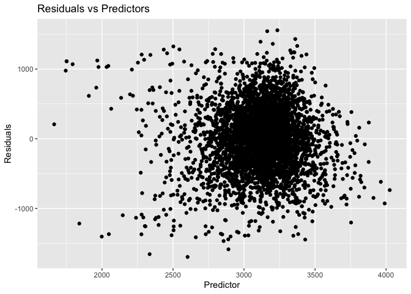
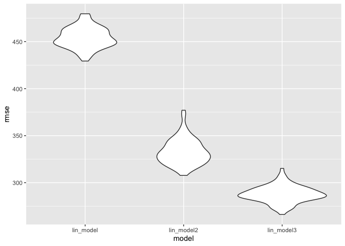
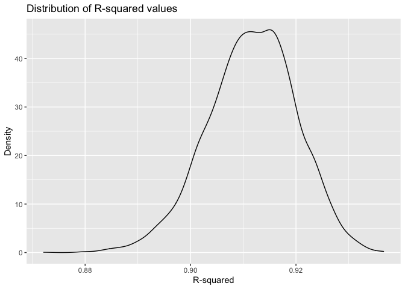
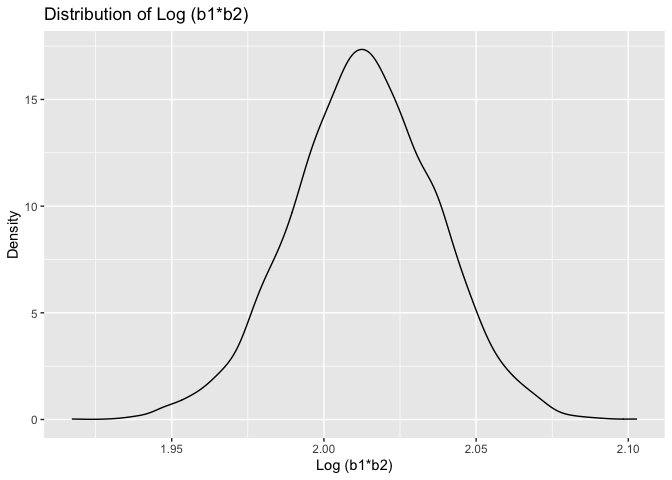

Homework 6
================
Gauri Bhatkhande
09/12/2020

``` r
library(tidyverse)
```

    ## ── Attaching packages ─────────────────────────────────────── tidyverse 1.3.0 ──

    ## ✓ ggplot2 3.3.2     ✓ purrr   0.3.4
    ## ✓ tibble  3.0.3     ✓ dplyr   1.0.2
    ## ✓ tidyr   1.1.2     ✓ stringr 1.4.0
    ## ✓ readr   1.3.1     ✓ forcats 0.5.0

    ## ── Conflicts ────────────────────────────────────────── tidyverse_conflicts() ──
    ## x dplyr::filter() masks stats::filter()
    ## x dplyr::lag()    masks stats::lag()

``` r
library(modelr)
library(mgcv)
```

    ## Loading required package: nlme

    ## 
    ## Attaching package: 'nlme'

    ## The following object is masked from 'package:dplyr':
    ## 
    ##     collapse

    ## This is mgcv 1.8-33. For overview type 'help("mgcv-package")'.

### Problem 1

``` r
homicide_df = 
  read_csv("data/homicide-data.csv", na = c("", "NA", "Unknown")) %>% 
  mutate(
    city_state = str_c(city, state, sep = ", "),
    victim_age = as.numeric(victim_age),
    resolution = case_when(
      disposition == "Closed without arrest" ~ 0,
      disposition == "Open/No arrest"        ~ 0,
      disposition == "Closed by arrest"      ~ 1)
  ) %>% 
  filter(
    victim_race %in% c("White", "Black"),
    city_state != "Tulsa, AL") %>% 
  select(city_state, resolution, victim_age, victim_race, victim_sex)
```

    ## Parsed with column specification:
    ## cols(
    ##   uid = col_character(),
    ##   reported_date = col_double(),
    ##   victim_last = col_character(),
    ##   victim_first = col_character(),
    ##   victim_race = col_character(),
    ##   victim_age = col_double(),
    ##   victim_sex = col_character(),
    ##   city = col_character(),
    ##   state = col_character(),
    ##   lat = col_double(),
    ##   lon = col_double(),
    ##   disposition = col_character()
    ## )

    ## Warning: 1 parsing failure.
    ##   row col   expected    actual                     file
    ## 37510  -- 12 columns 3 columns 'data/homicide-data.csv'

Start with one city.

``` r
baltimore_df =
  homicide_df %>% 
  filter(city_state == "Baltimore, MD")
glm(resolution ~ victim_age + victim_race + victim_sex, 
    data = baltimore_df,
    family = binomial()) %>% 
  broom::tidy() %>% 
  mutate(
    OR = exp(estimate),
    CI_lower = exp(estimate - 1.96 * std.error),
    CI_upper = exp(estimate + 1.96 * std.error)
  ) %>% 
  select(term, OR, starts_with("CI")) %>% 
  knitr::kable(digits = 3)
```

| term              |    OR | CI\_lower | CI\_upper |
| :---------------- | ----: | --------: | --------: |
| (Intercept)       | 1.363 |     0.975 |     1.907 |
| victim\_age       | 0.993 |     0.987 |     1.000 |
| victim\_raceWhite | 2.320 |     1.648 |     3.268 |
| victim\_sexMale   | 0.426 |     0.325 |     0.558 |

Try this across cities.

``` r
models_results_df = 
  homicide_df %>% 
  nest(data = -city_state) %>% 
  mutate(
    models = 
      map(.x = data, ~glm(resolution ~ victim_age + victim_race + victim_sex, data = .x, family = binomial())),
    results = map(models, broom::tidy)
  ) %>% 
  select(city_state, results) %>% 
  unnest(results) %>% 
  mutate(
    OR = exp(estimate),
    CI_lower = exp(estimate - 1.96 * std.error),
    CI_upper = exp(estimate + 1.96 * std.error)
  ) %>% 
  select(city_state, term, OR, starts_with("CI")) 
```

``` r
models_results_df %>% 
  filter(term == "victim_sexMale") %>% 
  mutate(city_state = fct_reorder(city_state, OR)) %>% 
  ggplot(aes(x = city_state, y = OR)) + 
  geom_point() + 
  geom_errorbar(aes(ymin = CI_lower, ymax = CI_upper)) + 
  theme(axis.text.x = element_text(angle = 90, hjust = 1))
```

<!-- -->

## Problem 2

**Importing the dataset**

``` r
birthweight_data = read_csv(file = "./data/birthweight.csv")
```

    ## Parsed with column specification:
    ## cols(
    ##   .default = col_double()
    ## )

    ## See spec(...) for full column specifications.

**Cleaning the dataset**

``` r
birthweight_data %>%
  sapply(function(x) sum(is.na(x))) 
```

    ##  babysex    bhead  blength      bwt    delwt  fincome    frace  gaweeks 
    ##        0        0        0        0        0        0        0        0 
    ##  malform menarche  mheight   momage    mrace   parity  pnumlbw  pnumsga 
    ##        0        0        0        0        0        0        0        0 
    ##    ppbmi     ppwt   smoken   wtgain 
    ##        0        0        0        0

``` r
birthweight_df = 
  birthweight_data %>%
  mutate(
    babysex = as.factor(babysex),
    frace = as.factor(frace),
    malform = as.factor(malform), 
    mrace = as.factor(mrace)
  )
```

**Proposed regression model for the outcome birthweight.**

Based on hypothesis found in literature, I have selected the following
variables as predictors: Mother’s weight gain during pregnancy (pounds)
(wtgain) Gestational age in weeks (gaweeks) Baby’s sex (babysex)

This model was decided based on literature evidence that suggested an
association between these predictors and the baby’s birthweight.

However, before building the regression model, we assume linearity and
hence it is necessary to make a scatterplot to see if the outcome and
predictor are linearly related.

**Making a scatterplot**

``` r
ggplot(birthweight_df, aes(x = wtgain, y = bwt, color = babysex)) + 
  geom_point() +
  geom_smooth(se = FALSE)
```

    ## `geom_smooth()` using method = 'gam' and formula 'y ~ s(x, bs = "cs")'

<!-- -->

``` r
ggplot(birthweight_df, aes(x = gaweeks, y = bwt, color = babysex)) + 
  geom_point() +
  geom_smooth(se = FALSE)
```

    ## `geom_smooth()` using method = 'gam' and formula 'y ~ s(x, bs = "cs")'

<!-- -->

It appears that there could be a linear relationship among the
predictors Mother’s weight and Gestational age when stratified by Baby’s
sex. Therefore I also decided to include the interaction term.

**Building the proposed model:**

``` r
lin_model = lm(bwt ~ wtgain*gaweeks*babysex, data = birthweight_df)

lin_model %>%
  broom::tidy() %>% 
  select(term, estimate, p.value) %>% 
  mutate(term = str_replace(term, "babysex2", "baby's sex: female")) %>% 
  knitr::kable(digits = 3)
```

| term                              |  estimate | p.value |
| :-------------------------------- | --------: | ------: |
| (Intercept)                       | \-979.074 |   0.000 |
| wtgain                            |    78.773 |   0.000 |
| gaweeks                           |   100.188 |   0.000 |
| baby’s sex: female                |   252.919 |   0.478 |
| wtgain:gaweeks                    |   \-1.773 |   0.000 |
| wtgain:baby’s sex: female         |  \-15.187 |   0.316 |
| gaweeks:baby’s sex: female        |   \-8.817 |   0.332 |
| wtgain:gaweeks:baby’s sex: female |     0.389 |   0.308 |

Since the p values for the interaction terms are not significant, I took
out the interaction terms from the model. Therefore my model now is:

``` r
lin_model = lm(bwt ~ wtgain + gaweeks + babysex, data = birthweight_df)

lin_model %>%
  broom::tidy() %>% 
  select(term, estimate, p.value) %>% 
  mutate(term = str_replace(term, "babysex2", "baby's sex: female")) %>% 
  knitr::kable(digits = 3)
```

| term               | estimate | p.value |
| :----------------- | -------: | ------: |
| (Intercept)        |  492.745 |       0 |
| wtgain             |    8.762 |       0 |
| gaweeks            |   62.707 |       0 |
| baby’s sex: female | \-90.744 |       0 |

The main effects show significant p values

``` r
birthweight_df %>% 
  modelr::add_residuals(lin_model) %>% 
  modelr::add_predictions(lin_model) %>%
  ggplot(aes(x = pred, y = resid)) + geom_point() +
  labs(
    title = "Residuals vs Predictors",
    x = "Predictor",
    y = "Residuals"
  )
```

<!-- -->

Most of the values were centered around the centre except for a few
values that strayed far from zero.

**Buiding the other two models:**

Model 2:

``` r
lin_model2 = lm(bwt ~ blength + gaweeks, data = birthweight_df)

lin_model2 %>%
  broom::tidy() %>% 
  select(term, estimate, p.value) %>% 
  knitr::kable(digits = 3)
```

| term        |   estimate | p.value |
| :---------- | ---------: | ------: |
| (Intercept) | \-4347.667 |       0 |
| blength     |    128.556 |       0 |
| gaweeks     |     27.047 |       0 |

Model 3:

``` r
lin_model3 = lm(bwt ~ bhead*blength*babysex, data = birthweight_df)

lin_model3 %>%
  broom::tidy() %>% 
  select(term, estimate, p.value) %>% 
  mutate(term = str_replace(term, "babysex2", "baby's sex: female")) %>% 
  knitr::kable(digits = 3)
```

| term                             |   estimate | p.value |
| :------------------------------- | ---------: | ------: |
| (Intercept)                      | \-7176.817 |   0.000 |
| bhead                            |    181.796 |   0.000 |
| blength                          |    102.127 |   0.000 |
| baby’s sex: female               |   6374.868 |   0.000 |
| bhead:blength                    |    \-0.554 |   0.478 |
| bhead:baby’s sex: female         |  \-198.393 |   0.000 |
| blength:baby’s sex: female       |  \-123.773 |   0.000 |
| bhead:blength:baby’s sex: female |      3.878 |   0.000 |

Fit the three models

``` r
lin_model = lm(bwt ~ wtgain + gaweeks + babysex, data = birthweight_df)
lin_model2 = lm(bwt ~ blength + gaweeks, data = birthweight_df)
lin_model3 = lm(bwt ~ bhead*blength*babysex, data = birthweight_df)
```

**Cross validation**

``` r
cv_df = 
  crossv_mc(birthweight_df, 100) 


cv_df =
  cv_df %>% 
  mutate(
    train = map(train, as_tibble),
    test = map(test, as_tibble))
```

``` r
cv_df = 
  cv_df %>% 
  mutate(
    lin_model  = map(train, ~lin_model),
    lin_model2  = map(train, ~lin_model2),
    lin_model3  = map(train, ~lin_model3)
    )%>% 
  mutate(
    rmse_lin_model  = map2_dbl(lin_model, test, ~rmse(model = .x, data = .y)),
    rmse_lin_model2 = map2_dbl(lin_model2, test, ~rmse(model = .x, data = .y)),
    rmse_lin_model3 = map2_dbl(lin_model3, test, ~rmse(model = .x, data = .y))
    )

cv_df %>% 
  select(starts_with("rmse")) %>% 
  pivot_longer(
    everything(),
    names_to = "model", 
    values_to = "rmse",
    names_prefix = "rmse_") %>% 
  mutate(model = fct_inorder(model)) %>% 
  ggplot(aes(x = model, y = rmse)) + geom_violin()
```

<!-- -->

Root mean square errors (RMSE) should be lower for the best fit models.
Here, my model is not a good fit as compared to models 2 and 3, as the
RMSE is very high. The third model is the best as it has the lowest
RMSE.

## Problem 3

``` r
weather_df = 
  rnoaa::meteo_pull_monitors(
    c("USW00094728"),
    var = c("PRCP", "TMIN", "TMAX"), 
    date_min = "2017-01-01",
    date_max = "2017-12-31") %>%
  mutate(
    name = recode(id, USW00094728 = "CentralPark_NY"),
    tmin = tmin / 10,
    tmax = tmax / 10) %>%
  select(name, id, everything())
```

    ## Registered S3 method overwritten by 'hoardr':
    ##   method           from
    ##   print.cache_info httr

    ## using cached file: /Users/gauribhatkhande/Library/Caches/R/noaa_ghcnd/USW00094728.dly

    ## date created (size, mb): 2020-12-09 17:30:14 (7.536)

    ## file min/max dates: 1869-01-01 / 2020-12-31

**Drawing bootstrap samples**

``` r
boot_sample = function(df) {
  sample_frac(df, replace = TRUE)
}

boot_straps = 
  data_frame(
    strap_number = 1:5000,
    strap_sample = rerun(5000, boot_sample(weather_df))
  )
```

    ## Warning: `data_frame()` is deprecated as of tibble 1.1.0.
    ## Please use `tibble()` instead.
    ## This warning is displayed once every 8 hours.
    ## Call `lifecycle::last_warnings()` to see where this warning was generated.

``` r
bootstrap_results_r_squared = 
  boot_straps %>% 
  mutate(
    models = map(strap_sample, ~lm(tmax ~ tmin, data = .x) ),
    results = map(models, broom::glance)) %>% 
  select(-strap_sample, -models) %>% 
  unnest(results)%>%
  janitor::clean_names() 

bootstrap_results_r_squared%>%
  ggplot(aes(x = r_squared)) +
  geom_density() +
  labs(
    title = "Distribution of R-squared values",
    x = "R-squared",
    y = "Density"
  )
```

<!-- -->

**Analysing**

``` r
bootstrap_results_log_b1_b2 = 
  boot_straps %>% 
  mutate(
    models = map(strap_sample, ~lm(tmax ~ tmin, data = .x) ),
    results = map(models, broom::tidy)) %>% 
  select(-strap_sample, -models) %>% 
  unnest(results) %>%
  select(term, estimate) %>% 
  pivot_wider(
    names_from = term,
    values_from = estimate
  )%>%
  janitor::clean_names() %>%
  unnest(c(intercept, tmin)) %>%
  mutate(
    log_b1_b2 = log(intercept * tmin)
  )
```

    ## Warning: Values are not uniquely identified; output will contain list-cols.
    ## * Use `values_fn = list` to suppress this warning.
    ## * Use `values_fn = length` to identify where the duplicates arise
    ## * Use `values_fn = {summary_fun}` to summarise duplicates

``` r
bootstrap_results_log_b1_b2%>%
  ggplot(aes(x = log_b1_b2)) + 
  geom_density() + 
  labs(
    title = "Distribution of Log (b1*b2)",
    x = "Log (b1*b2)",
    y = "Density"
  )
```

<!-- -->

**Identifying the 2.5% and 97.5% quantiles**

``` r
bootstrap_results_r_squared %>%
  summarize(
    ci_lower = quantile(r_squared, 0.025), 
    ci_upper = quantile(r_squared, 0.975))
```

    ## # A tibble: 1 x 2
    ##   ci_lower ci_upper
    ##      <dbl>    <dbl>
    ## 1    0.894    0.927

The distribution appears to be normally distributed.

The 95% confidence interval: (0.894, 0.927)

``` r
bootstrap_results_log_b1_b2%>%
  summarize(
    ci_lower = quantile(log_b1_b2, 0.025), 
    ci_upper = quantile(log_b1_b2, 0.975))
```

    ## # A tibble: 1 x 2
    ##   ci_lower ci_upper
    ##      <dbl>    <dbl>
    ## 1     1.97     2.06

The distribution appears to be normal. The 95% confidence interval:
(1.96, 2.06)
